# Documentação do Projeto (TIDocs)

Esta pasta armazena a documentação do projeto para a disciplina de **Trabalho Interdisciplinar 1** dos cursos de Tecnologia da Informação da **[PUC Minas](https://pucminas.br)**. Essa documentação é estruturada na forma de um site que fica disponível por meio do GitHub Pages e pode ser incluído, também, no site da solução hospedada. Um [exemplo publicado do TIDocs](https://webtech-puc-minas.github.io/ti1-template/) está disponível por meio do repositório do **[WebTech PUC Minas](https://github.com/webtech-pucminas)**.

A documentação do projeto inclui as seguintes seções:

1. Introdução
2. Contexto
3. Concepção
4. Metodologia
5. Solução
6. FAQ (Questões frequentes)
7. Referências Bibliográficas

O template para o site é estruturado e permite que a equipe evolua a documentação do projeto à medida que avance no desenvolvimento.

# Orientações gerais

FALTA COMPLETAR:
- Histórias de Usuários (montar tabela "o que sou?", "o que preciso?", "por que preciso?");
- Gestão de Projetos;

## Problema

Segundo uma pesquisa feita pela agência Brasil, pessoas entre 36 e 50 anos são as vítimas preferidas por golpistas na internet, sofrendo 35,9% das fraudes registradas. Os golpes virtuais, também conhecidos como golpes online ou cibernéticos, referem-se a práticas fraudulentas realizadas por meio da internet ou de dispositivos eletrônicos. Esses golpes geralmente têm o objetivo de enganar as vítimas para obter informações pessoais, financeiras ou confidenciais, ou para induzi-las a realizar ações prejudiciais. Como exemplo, temos as fraudes em compras online, na qual os golpistas criam sites falsos de comércio eletrônico que parecem ser legítimos, oferecendo produtos a preços muito baixos. Eles aceitam o pagamento, mas nunca enviam os produtos, ou enviam produtos falsificados ou de baixa qualidade. Os golpistas, em geral, visam o lucro e golpes que sejam mais rápidos de serem aplicados, procuram o ponto fraco da vitima (momentos de possivel falta de atenção ou conhecimento), na qual a vitima não verifica as informações, como, por exemplo, os e-mails falsos de venda no mercado livre, ou mensagens de compra por sms.

## Objetivos

Este trabalho tem como objetivo geral desenvolver uma aplicação web a fim de previnir golpes virtuais. Utilizando de conhecimentos agregados para facilitar o acesso a informação e como identificar possíveis armadilhas. Como objetivos especificos temos: o desenvolvimento de uma plataforma intuitiva para pessoas com dificuldades tecnológicas, estruturar um forúm para que os usuários da aplicação troquem informações sobres os golpes dos quais tem conhecimento e fornecer ferramentas necessárias para que os usuários identifiquem com facilidades Url's, telefones e propagandas falsas.

## Justificativa

Conforme a pesquisa realizada pelo Centro Regional de Estudos para o Desenvolvimento da Sociedade da Informação, cerca de 84% da população do pais tem acesso a internet. Diante disso, é inegável afirmar que a Internet se transformou em uma ferramenta essencial na rotina diária, assim como destacar que isso aumenta o risco de uma criminalidade digital, tornando  a população mais vulnerável à golpes virtuais, principalmente as pessoas que compõe o grupo mais sucetivel a serem as vitimas deste tipo de golpe. Assim, a justifica desse trabalho permeia no desenvolvimento de uma plataforma que visa auxilar as pessoas para que elas tenham menos risco de cair, dentro do contexto de prevenção. Essa prevenção seria feita por meio da facilitação do acesso a informação aos usuarios da web sobre os metodos mais famosos utilizados nesses golpes ciberneticos, ferramentas uteis para identificação de telefones, mensagens, url's e anuancios falsos, além de uma comunição facilitadas entre as possiveis vitima. Com tal maior acessibilidade, seria justificado a desenvolvemento desta plataforma para a ajuda na resolução de parte do problema social aqui descrito.

## Público-Alvo

O público-alvo da aplicação trata-se de todos usuários que navegam na WEB. Cada usuário tem a possibilidade de ser atraido para um link falso ou programa que roubará dados e afins. Por tanto, entende-se como Público-Alvo as possíveis vítimas destes golpes. Foi utilizado de um mapa de stakeholders para definir o as pessoas fundamentais, importantes e influênciadoras da aplicação. O diagrama abaixo destaca os principais stakeholders do trabalho e os conhecimentos levantados.

Foram definidos como pessoas fundamentais os usuários da web e os golpistas/hackers. Para as pessoas importantes temos: Bancos, Pessoas públicas, E-comerces, Governo, Grandes marcas e instituições e lojas de aplicativos. Por fim, as pessoas influenciadoras para a aplicação são: Comunidades e blogs online, a Opnião Pública, profissionais do direito, profissionais de segurança da informação e orgãos e instituições reguladoras da internet.

## Personas

As personas propostas estão descritas nas imagens a seguir.

A primeira persona, trata-se do perfil geral de um golpista, uma pessoa que tem como objetivo enriquecer rápido e sem esforço, independente dos meios para alcançar esse objetivo.

As propostas de valor para essa persona são:

A segunda persona, trata-se de um perfil mais suscétivel a ser vítima de um golpe virtual. Esta persona tem pouco conhecimento em navegar na web e de identificar possíveis fraudes, sejam de sites, em aplicativos ou no momento de realizar compras virtuais. 

As propostas de valor para essa persona são:

A terceira persona, trata-se de um usuário que agregará informações importantes ao sistema WEB. Auxiliando, os usuários e as possíveis vítimas, a como identificar as fraudes e golpes.

As propostas de valor para essa persona são:

A quarta persona, trata-se de outra vítima com perfil parecido a segundo. Entretanto, esta persona não possui conhecimento sobre como navegar na web e está totalmente desinformado sobre a possibilidade de sofrer golpes virtuais. Acredita em práticamente todo anúncio e informação passada, através da web até ele.

As propostas de valor para essa persona são:

Por fim, a quinta e ultima persona construída, trata-se de uma vítima que caiu em um golpe devido a pressa e falta de atenção. Esta persona possui conhecimentos avançados sobre o assunto e as ferramentas disponíveis na Web, mas por falta de tempo e atenção está suscetível aos golpes virtuais.

As propostas de valor para essa persona são:

## Histórias de Usuários

As Histórias de Usuário consistem em uma ferramenta poderosa para a compreensão e elicitação dos requisitos funcionais e não funcionais da sua aplicação. Se possível, agrupe as histórias de usuário por contexto, para facilitar consultas recorrentes à essa parte do documento. Abaixo, segue tabela com as histórias de usuários que serviram de base para elaboração dos requisitos do sistema.

QUEM SOU?	O QUE QUERO?	PARA QUE?
Eu, Claúdio, como usuário	quero saber se determinado link é seguro	para navegar na web com tranquilidade e segurança, sem ser alvo de fraudes
Eu, Mirian, como usuário	espero poder encontrar algum painel de informação com dados de golpes	para que eu possa identificar facilmente similaridades caso tentem realizar isto comigo.
Eu, Andrei, como usuário 	quero uma ferramenta rápida, simples de usar e confiável	para que eu tenha agilidade em encontrar possiveis fraudes.
Eu, Gabriel, como Profissional em segurança cibernética	quero uma plataforma intuitiva	para que  seja facil transmitir meu conhecimento e consiga ajuda pessoas leigas a se manterem seguras na Web.
Eu, Gabriel, como Profissional em segurança cibernética	quero um plataforma que ofereça meu curso	para que mais pessoas tenham conhecimento em como previnir e solucionar possiveis fraudes e golpes virtuais.

**Links Úteis**:

- [Histórias de usuários com exemplos e template](https://www.atlassian.com/br/agile/project-management/user-stories)
- [Como escrever boas histórias de usuário (User Stories)](https://medium.com/vertice/como-escrever-boas-users-stories-hist%C3%B3rias-de-usu%C3%A1rios-b29c75043fac)

## Requisitos

Requisitos Funcionais (RF):
1. Cadastro e Login:
    Os usuários podem se cadastrar e fazer login com nome de usuário e senha.
2. Informações sobre Golpes:
    O sistema mostra informações sobre diferentes tipos de golpes virtuais.
    Dicas são fornecidas para identificar e evitar golpes online.
3. Fórum de Discussão:
    Os usuários podem discutir golpes virtuais em um fórum.
    Os usuários podem criar novos tópicos e responder a outros.
4. Ferramentas de Verificação:
    Os usuários podem verificar a autenticidade de URLs, telefones e anúncios online.
5. Atualizações e Notificações:
    Os usuários recebem atualizações sobre novos golpes virtuais.
    Notificações são enviadas para alertar sobre possíveis ameaças.
6. Feedback dos Usuários:
    Os usuários podem fornecer feedback sobre o sistema.
    Eles podem relatar novos golpes virtuais que ainda não foram relatados no site.

Requisitos Não Funcionais (RNF):
1. Desempenho:
    O sistema deve ser rápido, carregando as páginas rapidamente e suportando uma grande quantidade de usuários simultâneos.
2. Confiabilidade:
    O sistema deve estar disponível a maior parte do tempo e deve ter uma capacidade de recuperação rápida de falhas.
3. Segurança:
    Todas as transações devem ser seguras, utilizando criptografia HTTPS, e os usuários devem ter a opção de autenticação de dois fatores.
4. Usabilidade:
    A interface do usuário deve ser fácil de usar, acessível para todos os usuários e seguir as diretrizes de acessibilidade da Web.
5. Manutenibilidade:
    O código-fonte deve ser bem documentado e fácil de modificar, seguindo as melhores práticas de desenvolvimento.
6. Portabilidade:
    O sistema deve funcionar em diferentes navegadores da web e ser facilmente implantado em diferentes ambientes de hospedagem.

## User Flow

O User Flow do trabalho foi criado utilizando da plataforma Miro, de acordo com o link: https://miro.com/app/board/uXjVKU2rS70=/ . Todo o fluxo do sistema e as respectivas páginas a serem acessadas pelo usuário. Bem como, às funções disponíveis na aplicação a ser construída. O user flow foi realizado em conjunto com o Wireframe em baixa resolução e estará disposto na próxima sessão deste documento. 

## Wireframes

Wireframes são protótipos das telas da aplicação usados em design de interface para sugerir a estrutura de um site web e seu relacionamentos entre suas páginas. Um wireframe web é uma ilustração semelhante ao layout de elementos fundamentais na interface. Dessa forma, o grupo decidiu construir dois Wireframes para representar o Sistema Web. O primeiro a ser disposto será o wireframe em baixa resolução, ainda sem apresentação das imagens e palhetas de cores a serem utilizadas nma construção da aplicação. O segundo wireframe, trata-se de um prototipo de alta resolução, já definindo com mais rigor a paleta de cor aplicada, bem como as composições de estruturas presentes no sistema. Para realizar a elaboração do wireframe de alta resolução, foi utilizada a plataforma Figma disposta a baixo na sessão de links uteis.

Wireframe de baixa resolução com User Flow integrado:

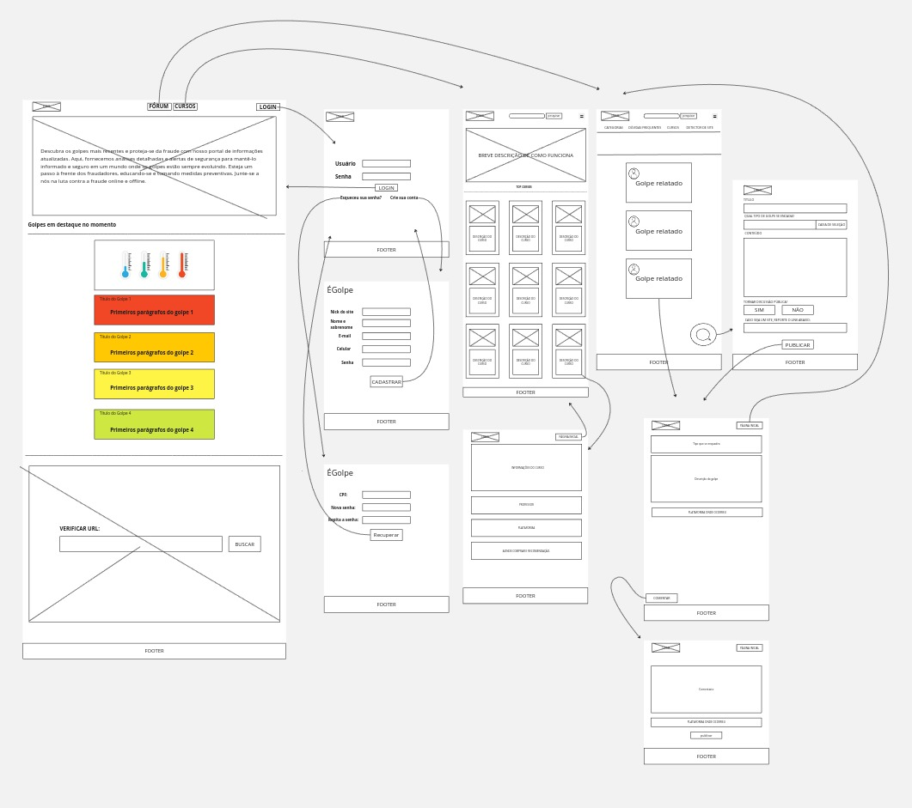

Visando tornar o Wireframe mais "limpo", foram omitidas os retornos a página incial do site ao clicar na Logo no canto superior esquerdo.

Wireframe de alta resolução:

## Versão Desktop

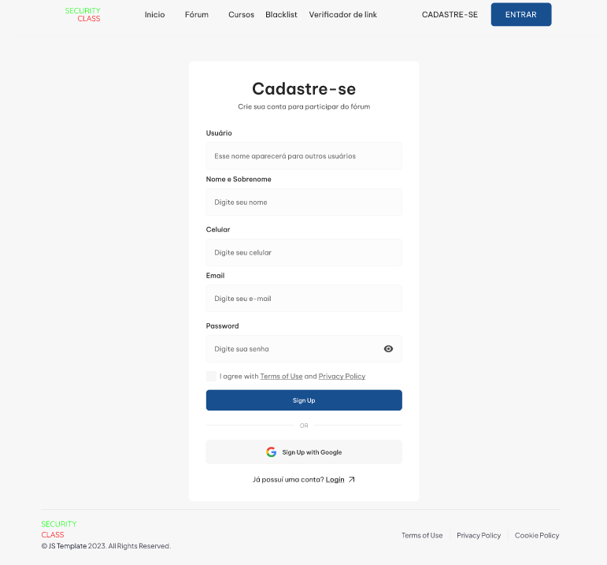

- Formulário de Cadastro

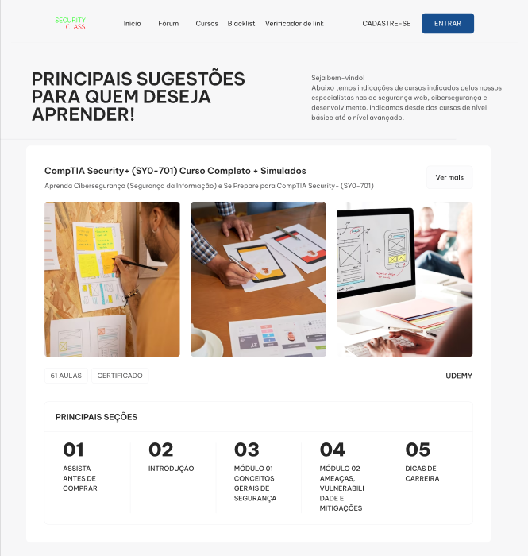

- Página de Cursos

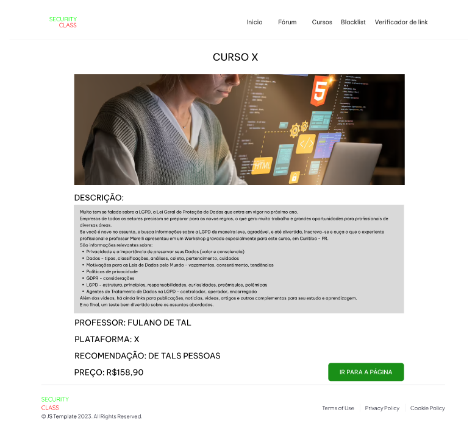
 
- Descrição dos Cursos

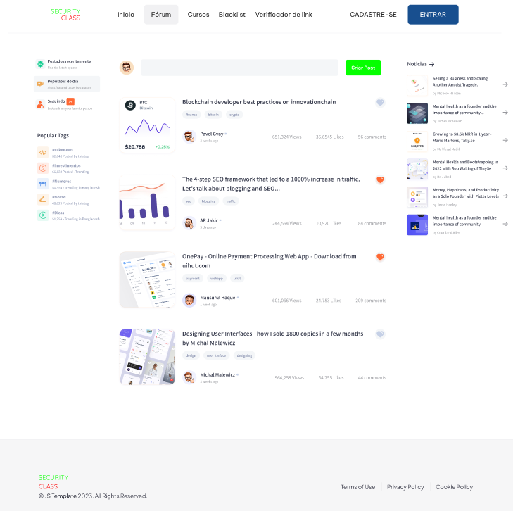

- Página do Fórum

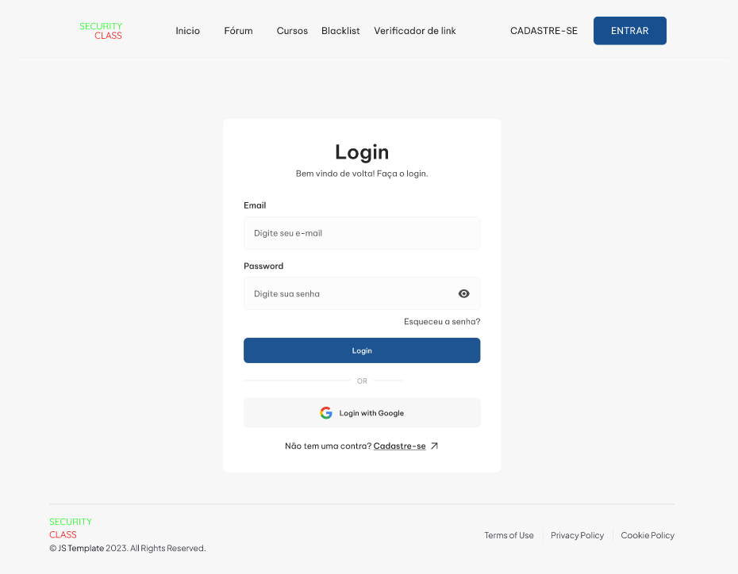

- Página de Login

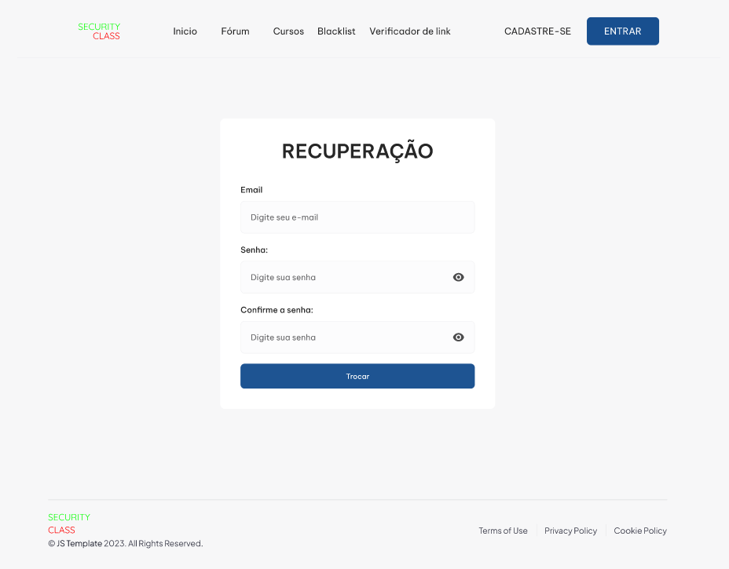

- Recuperação de Conta

- Lista de Exclusão

## Versão Mobile

Também oferecemos uma versão mobile do projeto com as seguintes funcionalidades:

- Formulário de Cadastro (Mobile)

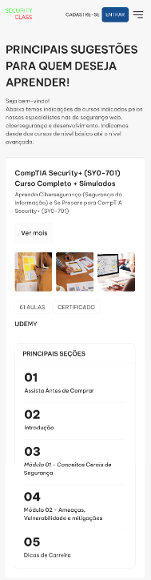

- Página de Cursos (Mobile)
  
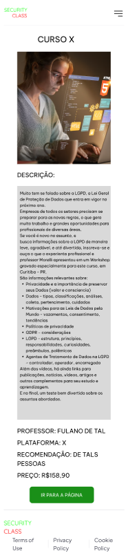

- Descrição dos Cursos (Mobile)
  
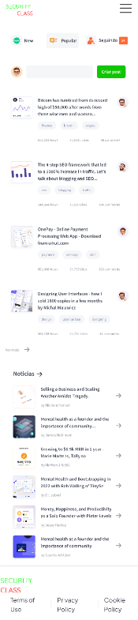

- Página do Fórum (Mobile)
  
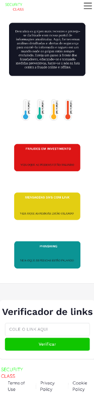

- Página Inicial (Mobile)
  
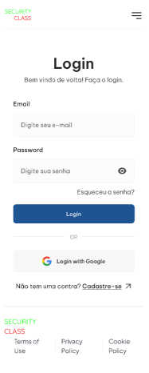

- Página de Login (Mobile)
  
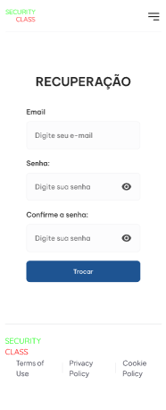

- Recuperação de Conta (Mobile)
  
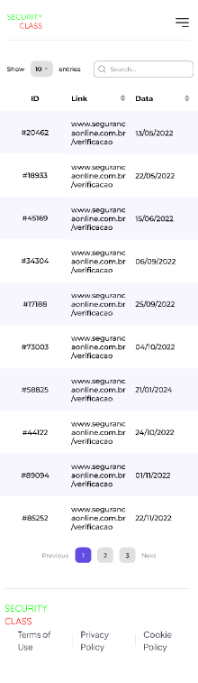

- Lista de Exclusão (Mobile)

**Link do nosso projeto no Figma**:
[Security Class](https://www.figma.com/file/00Zv1xsk6vGzwMRtS4ZyTj/SecurityClass.com?type=design&node-id=20-2&mode=design&t=thWtMzvLwk0jtheQ-0)

## Gestão de Projetos

 Nesta parte do documento, você deve apresentar  o processo de trabalho baseado nas metodologias ágeis, a divisão de papéis e tarefas, as ferramentas empregadas e como foi realizada a gestão de configuração do projeto via GitHub.

Coloque detalhes sobre o processo de Design Thinking e a implementação do Framework Scrum seguido pelo grupo. O grupo poderá fazer uso de ferramentas on-line para acompanhar o andamento do projeto, a execução das tarefas e o status de desenvolvimento da solução.

**Links Úteis**:

- [Sobre Projects - GitHub Docs](https://docs.github.com/pt/issues/planning-and-tracking-with-projects/learning-about-projects/about-projects)
- [Gestão de projetos com GitHub | balta.io](https://balta.io/blog/gestao-de-projetos-com-github)
- [(460) GitHub Projects - YouTube](https://www.youtube.com/playlist?list=PLiO7XHcmTsldZR93nkTFmmWbCEVF_8F5H)
- [11 Passos Essenciais para Implantar Scrum no seu Projeto](https://mindmaster.com.br/scrum-11-passos/)
- [Scrum em 9 minutos](https://www.youtube.com/watch?v=XfvQWnRgxG0)
